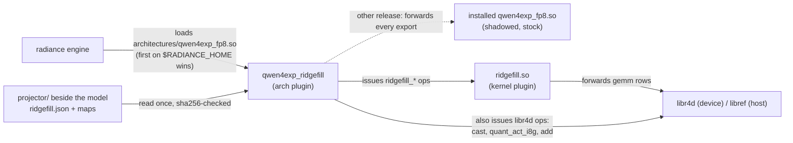
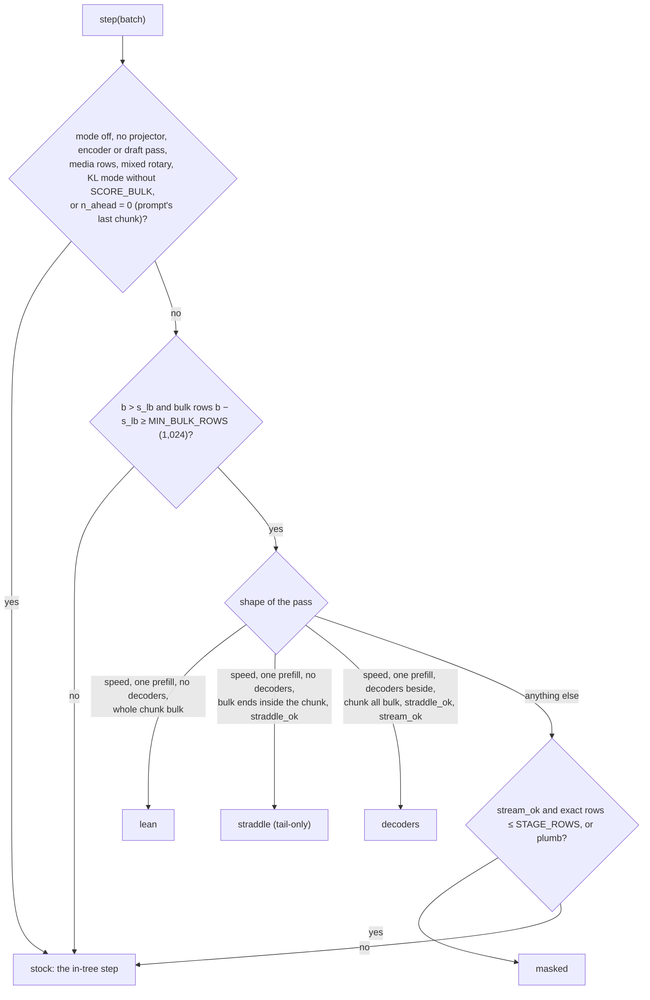
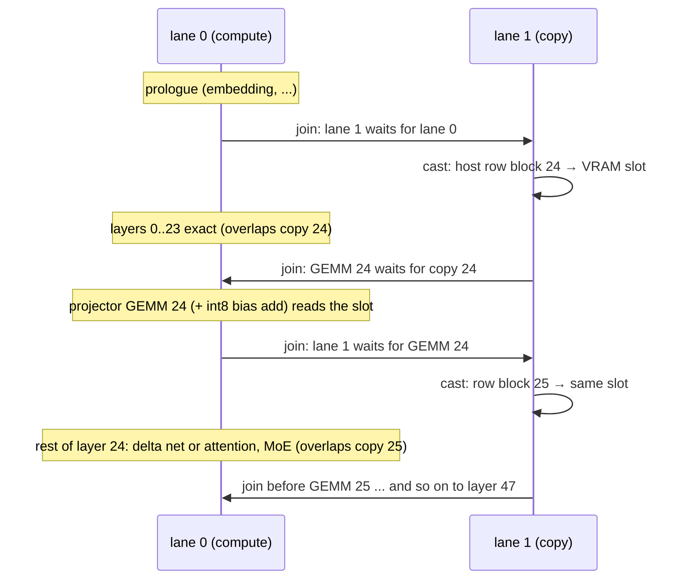

# How the RidgeFill plugin works

This is the plugin as it is on `main`, built against radiance 1.0.13, serving Qwen3.8-Flash-Next (arch id
`qwen4exp`, 48 layers, model width 2,560, a hyper-connection residual stream 4 × 2,560 = 10,240 wide). Every
claim names the file and function it comes from. Numbers come from the notes named next to them.

## The idea

Most of a long prompt is **bulk**: rows that have at least `T` more prompt tokens after them (`T` is the
**exact tail**, `RADIANCE_RIDGEFILL_TAIL`, default 2,048). The prompt's answer is read from its last row, and
later layers of bulk rows matter only through the caches they leave behind: attention K/V and indexer keys,
and the gated delta net's recurrent state. So for bulk rows the plugin runs layers 0..S−1 exactly (S = 24,
the **split**, taken from the projector folder). For each **late layer** l ≥ S it predicts that layer's
block input with a **projector**, a ridge map fitted offline (`proj.l`: [2,560 × 10,240] plus bias) applied
to the layer-S stream, and writes the caches from that prediction. The last `T` rows and, in quality mode, a
selected share of bulk rows stay exact. Because bulk rows feed the delta net's state through the
projector, the state at the end of the bulk is off by a roughly constant amount. A fitted per-head
**correction** `C` (`st.l`) is added at the bulk end and taken back before the next chunk's scan.

Terms used below:

| term | meaning |
|---|---|
| pass / step | one call of the architecture's `step()`: one batch of rows (prefill chunks, decode rows) |
| chunk | the slice of one prompt a step carries; at most `--max-num-batched-tokens` rows |
| bulk end `b` | the first row of a chunk that must stay exact (`ridgefill_plan.h` `bulk_end`) |
| layer-S stream | the wide residual stream entering layer S, which every projector reads |
| late layer | a layer ≥ S (24..47 here: 18 delta-net layers, 6 attention layers) |
| modes | `off` (stock, default), `quality`, `speed`, `plumb` (oracle: the plugin's path with nothing approximated) |

## Where each piece lives in radiance

radiance has three plugin kinds (radiance `docs/PLUGIN.md`): **kernel libraries** (implement ops),
**architectures** (declare a model's weights and buffers and issue its ops each step) and **quantisers**
(used by `rad-convert`). RidgeFill ships one architecture and one kernel library and no quantiser.

### The architecture plugin shadows the in-tree one

`arch/CMakeLists.txt` builds the target as `qwen4exp_fp8`, so the file is `architectures/qwen4exp_fp8.so`,
the same stem as radiance's own Qwen4-Exp plugin. The engine refuses two plugins claiming the same
`(qwen4exp, "")`, so the plugin does not register a second claim. It replaces the installed file **by stem**:
a `$RADIANCE_HOME` entry ahead of the installation's wins, and the loader logs the installed file as shadowed.
Its plugin name is `qwen4exp_ridgefill`. `arch/qwen4exp_ridgefill.cpp` `#include`s the in-tree
`arch/qwen4exp_fp8/qwen4exp_fp8.cpp` whole, with its exports suppressed, and exports its own `declare`,
`step` and `probe`. The top-level `CMakeLists.txt` requires the source checkout (`RADIANCE_SRC`) and the
installed engine to be the same release, with byte-identical headers. In `off` the plugin runs the
included declare and step and adds nothing (`core_declare` returns before declaring anything);
`tests/arch_static_test.cpp` holds the graph and the issued sequence to the in-tree plugin's.

**The release guard** (`arch/ridgefill_guard.h` `open_guard`, run from `rad_plugin_open`): the plugin finds the
object that defines `rad_issue` and counts the NUL-delimited copies of the release string it was built
against (`RIDGEFILL_RADIANCE_VERSION`, "1.0.13"). Exactly one copy means it serves. Any other count means it looks
for `architectures/qwen4exp_fp8.so` on `$RADIANCE_HOME` that is not itself, `dlopen`s it and forwards
`probe`/`declare`/`step` there (`take_forward`). The engine then serves stock with RidgeFill off, and the plugin
logs a WARNING naming both releases and the engine's sha256. If there is no file to forward to, the plugin
declines and startup fails by name.

### Core and adapter

The model-independent **core** is `arch/ridgefill_*.h` (namespace `ridgefill`; it names no model type). It holds the
plan (`ridgefill_plan.h`), switches (`ridgefill_config.h`), declarations (`ridgefill_declare.h`, `ridgefill_declare_masked.h`,
`ridgefill_final.h`), the folder (`ridgefill_folder.h`, `ridgefill_match.h`, `ridgefill_projector.h`, `ridgefill_int8.h`), the layer
drivers and streaming (`ridgefill_layer.h`), the step (`ridgefill_step.h`), the guard and the hazard instrument.
`ridgefill_core.h` includes them in order.

The **adapter** is the model's half: `qwen4exp_adapter.h` (`adapter_of`: facts read from the in-tree model
after its declare, plus hook bodies), `qwen4exp_blocks.h` (the delta net's and attention's in-tree issues
over a row window, with the correction spliced into the last sequence's scan), `qwen4exp_fill.h` (the
lean pieces: only the ops that write caches) and `qwen4exp_moe.h` (the MoE issued by hand so bulk rows'
routing can be dropped and the stager probes inserted). `arch/qwen4exp.copies` lists which in-tree files
these copy, for `scripts/update_radiance.sh`.

The interface between them is one struct, `ridgefill::RidgeFillAdapter` (`arch/ridgefill_adapter.h`). It carries
**facts** (layer count, widths, the delta net's chunk tile `tile` = 64, `split_lo`, per-layer arrays for
attention vs recurrent / routed / pre-normed input, MoE `top_k`, the state shape, the buffers the core
issues against, `min_tail` 512 and `default_tail` 2,048) and **hooks** (`declare_model`, `declare_codes`,
`decl_state_ops`, and for the step `conn`, `late_block`, `ffn`, `prologue`, `stock_layer`, `epilogue`,
`stock_step`, plus the capture hooks). A null hook is a capability the core skips.
`docs/ADDING-A-MODEL.md` is the checklist.

### ridgefill.so: the ops

`kernels/rows.cpp` defines the schemas and rows. Each op has a host row in plain C++ (`host_ref.cpp`, the
oracle the tests compare against) and, in a HIP build, a device row. The two forwarded GEMMs are the
exception: their rows are the source library's.

| op | what it computes | when it runs |
|---|---|---|
| `ridgefill_mask` | the device mask: which rows of the step's last sequence use the projection. It reads `{s, e}` from `cu_seqlens` on the device, takes window `[s, b')` and writes `mask[n]` and `bounds = {s, b', b', e}`. Rule per mode: speed approximates the whole window, plumb none, quality keeps exact `rint(share × matches)` of the rows whose token has a finite score in the row table (highest score first). It also zeroes the stager probes' expert offsets | once per masked / straddle / decoders pass, before layer 0 (`ridgefill_step.h` `mask_rows`) |
| `ridgefill_select` | byte copy: on rows with `mask == 1`, the projected input (and its fp8/int8 codes and scales) overwrites the exact block input | per late layer on the masked path (`project_masked`); for the final map on masked/straddle paths |
| `ridgefill_drop_rows` | sets the MoE expert ids of masked rows to −1, so their experts are neither staged nor computed | per late layer on the masked path, between top-k and scatter (`qwen4exp_moe.h`) |
| `ridgefill_rho_update` | quality only: per head, the decayed share of approximated rows in the delta-net state (`D = e^g·D + 1; N = e^g·N + mask`) | per late delta-net layer, before the apply (`qwen4exp_blocks.h` `decay_sums`) |
| `ridgefill_state_correct` | `undo`: `state −= applied·C`. `apply`: `state += s·C` with `s = alpha × clamp(N/D, 0, 1)` (quality) or `alpha` (speed), and it records `s` | per late delta-net layer: undo before the scan, apply at the bulk end (`correct`) |
| `ridgefill_state_read` | copies a sequence's delta-net state slot out | debug/refit captures only (`RADIANCE_RIDGEFILL_CAPTURE_STATE`) |
| `ridgefill_hazard` | counts prefix-cache positions inside this request's exact tail that the request that wrote the snapshot had approximated; records this pass's last bulk position | end of every speed/quality pass that approximates or still has tail ahead (`ridgefill_hazard.h`) |
| `ridgefill_gemm_nt_bias` | libr4d's `gemm_nt_bias` (device) / libref's (host) rows, re-offered with weight and bias as plain inputs: the projector is plugin memory, not a container weight (`forward.cpp`) | per late layer with a bf16 folder; the final map's GEMM |
| `ridgefill_gemm_nt_q` | libr4d's int8 `gemm_nt_q` (dtype `i8a8`) rows with their layout hooks, weight and scale as inputs. No host row | per late layer with the int8 folder (the shipped one) |

The plugin also issues three stock libr4d ops: `cast` bf16→bf16 (the ring's byte copy, `decl_ring`;
the copy into `h_S`), `quant_act_i8g` (the layer-S stream's int8 codes, once per pass) and `add` (the int8
GEMM's bias). If libr4d is not loaded, the forwarded ops have no row, and the mode refuses at startup by
name (`decl_selected`).

## Choosing the plan for a step

`ridgefill_step.h` `derive` fills a `PlanIn` from the batch, and `ridgefill_plan.h` `plan_pass` (a pure function, held
to a truth table in the static test) picks one path:

The bulk end: `b = n_tok` if `n_ahead ≥ T`, else `n_tok − ceil64(T − n_ahead)`. `n_ahead` is the count of
prompt tokens after this chunk, capped by the scheduler at one step. When a checkpoint is written,
`RADIANCE_RIDGEFILL_CKPT_FLOOR` pulls `b` back further. `s_lb = max(n_tok_decode, n_tok − max prefill q)` is the
host's lower bound for the last sequence's first row. The exact row `s` is device data, which `ridgefill_mask`
reads.

| path | late layers do | MoE for bulk rows |
|---|---|---|
| **lean** (speed) | projector, then only the cache writers: attention K/V + indexer keys, or delta-net projections + corrected scan (`fill_layer`) | not run |
| **straddle** (speed) | bulk rows `[0, b)` lean; tail rows `[b, n)` the whole in-tree layer over that row range (`straddle_layer`). Needs every late attention layer on its per-row sparse form, i.e. context past the indexer's exactness bound (`qsa_exact_to` = indexer budget + ratio − 1 = 2,048 + 4 − 1 = 2,051 on this checkpoint, radiance `docs/QSA.md`) | not run |
| **decoders** (speed) | bulk rows lean; decoder rows `[0, DT)` the whole layer, dense GEMMs at M = DT, the decode-only shape (`decoders_layer`) | not run; decoders' experts stream |
| **masked** (quality; speed's other shapes; plumb) | every in-tree op over all rows; `ridgefill_select` puts projected inputs on masked rows (`masked_layer`) | dropped by `ridgefill_drop_rows` |
| **stock** | the in-tree step (`stock_step`) | — |

Guard thresholds and refusals: `MIN_BULK_ROWS` (default 1,024; every approximate pass streams the whole
projector, and a 64-row checkpoint remainder cost 208–222 ms approximated against 61–92 ms stock,
notes/stageb.md session 2c). `STAGE_ROWS` (default unlimited). At startup, `check_mode` refuses `T` above
2 × `--max-num-batched-tokens` − 64 (no row could ever be bulk) or below the adapter's 512.

**Streaming the late experts (the stager lever).** On a streaming pass (masked or decoders), `stock_layer` attaches zero-row
**probes** behind layer S−3's gate-up GEMM. These are the gate-up handle of every layer from S−1 up, issued
with all expert offsets zero, so they read no weight. They make radiance's expert stager **stream** the late
layers (read only the routed experts of exact rows) instead of staging each layer whole
(`qwen4exp_adapter.h` `probe_arm`, notes/impl.md §2). A probe moves no number. `stream_ok` needs
`RADIANCE_RIDGEFILL_STAGE=auto` and three routed layers below S. Quality on a pass that cannot stream runs stock,
because a masked pass that stages its late layers measured slower than the exact step.

**Why host decisions read only keyed batch fields.** radiance records a recurring pass as a tape keyed on
the batch's counts, pointers and KV geometry plus runtime state (`core/runtime/ctx.cpp` `pass_key`). Once
the tape is verified, the engine replays it without calling `step()`. So anything the host decides must be
a function of keyed fields (`n_tok`, `n_seq`, `n_ahead`, `n_checkpoints`, `max_ctx_len`, decode counts, …)
and declare-time config. Otherwise a replay would issue a different pass. Row-level facts (`s`, which rows
are bulk, the class rule) are decided on the device by `ridgefill_mask`. The hazard counter is read by the host
for the log only. One consequence: a replayed approximate pass prints no `approximate step` line, so
`scripts/grade.sh` counts logged and replayed passes.

## The projector folder

| file | contents | read by |
|---|---|---|
| `ridgefill.json` | manifest (format 1): adapter `qwen4exp`, split 24, stream width 10,240, layer kinds, projector dtype (`bf16` or `i8`), the model fingerprint, every listed file's sha256 | `ridgefill_folder.h` `read_folder` |
| `proj8.L24.safetensors` … `proj8.L47.safetensors` | int8 maps: `proj.l.codes` i8 [2,560 × 10,240], `proj.l.scale` bf16 per 128 columns, `proj.l.bias` bf16 (the bf16 folder: `proj.L<l>` with `proj.l.weight`) | `check_map`, relaid out at load by libr4d's own layout hook (`ridgefill_int8.h`) |
| `correction.safetensors` | `st.l` f32 [48 heads × 128 × 128] for the 18 late delta-net layers (each rank takes its own heads) | `plan_rank` |
| `rowsel.safetensors` | `score` (the class table) and the controls `score_none`, `score_all`, f32 [vocab] | quality only (`RADIANCE_RIDGEFILL_ROWSEL_TABLE`) |
| `chat_template.jinja` | left from the parked per-request feature; hashed, never read | — |
| `README.md` | documentation, **not listed** in the manifest | — |

**Discovery** (`find_folder`), first hit wins. (1) `$RADIANCE_RIDGEFILL_PROJECTOR`. (2) `projector/` beside the
`--model` path as typed in `/proc/self/cmdline`, accepted only if it is the same file (device and inode) as
the container mapped in `/proc/self/maps`, which keeps a Hugging Face snapshot symlink's own directory.
(3) `projector/` beside the resolved, mapped file. A directory counts only if it holds `ridgefill.json`. With no
folder the engine serves stock and says so.

**Checks, once per process** (`load_folder`). Every listed file is mapped and hashed, one thread per file.
Any missing or corrupt file, malformed tensor or duplicate name **refuses** the folder by name. Then
`ridgefill_match.h` `match_model` sorts differences into two classes:

- **Refuse** ("cannot run"): another adapter or arch id, any differing metadata key the manifest names
  (layer count, widths, vocab size, expert count, layer types, delta-net head geometry), or another
  tokenizer (the vocab hash covers each token's text and type in id order plus the merge table; the row
  table is indexed by token id). Then `check_tensors` checks every shape against the adapter's facts. A
  refusal logs `REFUSED ... serving stock`, and nothing is declared, so the graph is the in-tree one.
- **Warn** ("fitted on another variant"): different encodings of the named late-layer weights (another
  quantisation or recipe), different content anchors (sha256 of three hyper-connection norms around the
  split, i.e. other base weights), or another model name. RidgeFill runs, and each difference is logged.

On success one line reads, for example, `RidgeFill: projector … matches qwen4exp: arch ok, metadata 11/11,
tokenizer ok, encodings 489/489, anchors 3/3, 0 warning(s); split 24, correction held, 666.4 MiB in 27
files` (notes/release-session.md). That line is the only sign that RidgeFill is active.

**Why documentation is not in the manifest.** A model hub serves a repo's `README.md` as its model card,
so the README a user downloads differs from the one the builder wrote. The loader verifies exactly the
listed files and ignores the rest, so a hashed README would make a correct folder be refused. So
`tools/ridgefill_projector.py` (`is_doc`, `hashed`) never lists `*.md`, its `reseal` subcommand drops docs from an
existing manifest after re-checking every remaining hash, and `tools/package.py` refuses a manifest that
lists documentation.

## Streaming the projector

**Where the bytes live.** At each rank's real declare, `ridgefill_projector.h` `upload_rank` allocates **one
host-mapped block** per rank (`rad_dev_alloc(..., RAD_MEM_HOST_MAPPED)`). It holds every late layer's map
as one **row block** of 10,240-element bf16 rows (`row_block`): bf16 is the map's 2,560 rows plus one bias
row = 2,561 rows; int8 is libr4d's stored codes, then scales, then bias, at 256-byte offsets = 1,301 rows.
The block also holds this rank's correction heads and the row table, which their kernels read zero-copy
on approximate passes only. The only VRAM allocation is **one staging slot**, the size of one row block
(25.4 MiB int8, 50 MiB bf16). The engine's budget counts it as already held. The startup line reads `rank N
holds the projector: 637.8 MiB host-mapped (int8 maps, correction, row table), 25.4 MiB VRAM (the staging
ring's one slot)`.

**When each copy runs** (`ridgefill_layer.h` `ring_copy`, `ring_wait`, `ring_after`). radiance gives an
architecture a second stream, **lane 1**. `rad_lane_join(from, to)` records an event on one lane and makes
the other wait on it, so the host never blocks.

Copy 24 is issued right after the prologue and overlaps the 24 exact layers. Each later copy is issued as
soon as the previous layer's GEMM (and bias add), the slot's last reader, has been handed to lane 0, and it
overlaps the rest of that layer. With one slot the copy cannot overlap the GEMM itself, which costs under
1 ms at 2,048 rows. A second slot would buy that overlap for another block of VRAM on every card
(notes/stagee.md §14). The copy is libr4d's `cast` bf16→bf16, a pure byte copy, so int8 codes ride it as
bf16 pairs. **A pass that does not approximate copies nothing**: `ring_copy` is reached only from
`approximate_step`, so stock passes leave the slot idle.

**Bytes and time per rank** (notes/stagee.md §15, §19):

| | per copy | per approximate pass (24 copies) | copy time, rank 0 / rank 1 (each copy alone, `--profile-ops`) |
|---|---|---|---|
| int8 (shipped) | 1,301 × 20,480 B = 26.6 MB | 0.639 GB | 0.50 ms / 4.53 ms |
| bf16 | 2,561 × 20,480 B = 52.4 MB | 1.259 GB | 0.97 ms / 8.77 ms |

On the measurement machine the second card (rank 1) sat on a PCIe Gen4 x4 link (~6–7 GB/s), which is why
its copies take about 9× rank 0's. There, rank 1's copy time per pass was ~95 ms int8 against ~210 ms bf16,
and int8 measured 2.5–4.7% faster time to first token than bf16 at equal quality (notes/stagee.md §11,
§15). That is why int8 is the only shipped folder.

**Why the maps are not kept in VRAM.** An earlier placement held all maps in VRAM (1.2 GiB per card in
bf16). That cost about 1,100 resident expert slots per card. It also made a configuration stock radiance
serves (`--max-num-batched-tokens 8192 --max-num-seqs 10`) refuse to start, because the pinned pool
overflowed: "DID NOT FIT 461 gate_up experts: host pool full". The plugin gets no memory budget at
declare, so it cannot choose a placement that fits. VRAM placement and the zero-copy variant were removed,
and `RADIANCE_RIDGEFILL_PROJ_PLACE` and `RADIANCE_RIDGEFILL_PROJ_RING` are refused by name (`ridgefill_config.h`
`read_variants`).

**The residual on stock-path prompts.** A RidgeFill server still holds about 67 MiB of VRAM per rank (int8): the
25.4 MiB slot plus ~41 MiB of whole-program arena (the stream's int8 codes, the projected input and its
codes, and in-tree buffers the plugin's ops make whole-program). That memory would otherwise go to resident
experts, about 63 of ~16,850 slab slots. Measured with every pass on the stock step against stock started
in the same session, matched settled state: **+0.9% at 2K and +1.2% at 8K prompt tokens**. Decode is
unchanged (notes/stagee.md §19). This was accepted as the floor.

## Prefix cache, concurrency, images, MTP

**Prefix cache.** The plugin's per-sequence device state is held in LINEAR KV groups bound to late layers:
`kv_ridgefill_applied` (the applied correction scale), `kv_ridgefill_rho` (quality's N, D) and `kv_ridgefill_meta` (the hazard
slot). The engine zeroes them at admission and snapshots them with every checkpoint, so a restored request
resumes with the right correction. Turn-2 cache hits equal stock's (R62, notes/stagec.md).

One case is inherent. Request A writes a checkpoint at P, and a shorter request B branches off it. Some of
B's exact-tail positions before P were bulk for A and so were approximated. `ridgefill_hazard` counts these
**hazard positions** exactly, on the device. Rank 0 logs `ridgefill: hazard <n> positions (total <m>)` when the
counter moves, on a later step. Measured on 9 real branches: 1,290–1,772 positions each, equal to the
oracle (notes/stagec.md C2). `RADIANCE_RIDGEFILL_CKPT_FLOOR=T_ck` keeps the last T_ck rows of every
checkpoint-writing chunk exact, which lowered each branch's count by exactly T_ck at 512. The default is 0.

**Concurrency.** Quality takes the masked path whenever decoders or other prompts share the step. Their
rows run the in-tree ops at stock shapes, and only the last sequence's rows can be masked. Decoders'
outputs and delta-net states were **byte-identical to off** (R54, R61, notes/stageb.md). Speed's decoders
path runs decoders at M = DT, so their bytes may differ. Measured per decoder, mean KL against off in the
same arrangement was 0.0005–0.0029, below stock's own batched-vs-solo difference for the same decoder
(0.023–0.74). With MTP on (the release config) the scheduler was observed never to co-batch decode with
prefill, so that path was not reached there (notes/stagec.md C2).

**Images and video.** `derive` makes a pass ineligible when it is an encoder pass, carries media rows or
has mixed rotary components. Those steps run stock. Each later text-only chunk is decided on its own keyed
fields and approximated again at its rotary positions (R76: plumb after an image = off byte for byte,
notes/staged.md).

**MTP.** Draft and history passes are never approximated (`draft_pass == 0` is required), so plain MTP
drafting works. The release session measured 2.31 tokens/step stock and 2.30 quality at 16K with depth 3.
An optional second map that feeds the drafting head is off by default: see
[MTP-FINAL-MAP.md](MTP-FINAL-MAP.md).

## Life of one request

A 32,000-token prompt, alone on the server, in the release config (`--max-num-batched-tokens 2048`,
`T` 2,048, int8 folder, prefix cache on):

| chunk | rows | `n_ahead` | `b` | speed path | quality path |
|---|---|---|---|---|---|
| 1–14 | 0–28,671 | 2,048 | 2,048 (all bulk) | lean | masked, streaming |
| 15 | 28,672–30,719 | 1,280 | 2,048 − 768 = 1,280 | straddle: 1,280 bulk, 768 exact | masked: window `[0, 1,280)` |
| 16 | 30,720–31,999 | 0 | — | stock | stock |

- **Chunks 1–14.** Layers 0–23 run exactly. In speed, each late layer runs the projector on the layer-S
  stream, then only its cache writers: K/V and indexer keys for the 6 attention layers, and for the 18
  delta-net layers the projections, `undo`, the scan and `apply`. No late MoE and no late block outputs
  are computed. In quality, `ridgefill_mask` marks the rows, every late layer runs whole with the projected
  input selected in, the class-selected 25% of matching rows keep their exact input, `ridgefill_drop_rows` empties
  the masked rows' expert slots, the probes make the late experts stream, and the correction is scaled by
  ρ from `ridgefill_rho_update`. Each pass streams 24 × 26.6 MB = 0.639 GB to each rank through the slot.
- **Chunk 15.** In speed, the delta net scans `[0, 1,280)`, applies the correction, then scans the
  768 tail rows from the corrected state (`RADIANCE_RIDGEFILL_STRADDLE=split`, `gdn_prefill_scans`). Attention
  and MoE outputs are computed for the tail rows only. Context here is far past 2,051, so `straddle_ok`
  holds. Quality does the same split scan inside the masked path.
- **Chunk 16.** This is the prompt's last chunk (`n_ahead` = 0), so it runs stock. Its last row gives the
  first token. With MTP on, that chunk's history pass drafts.
- **Exact rows.** 768 + 1,280 = 2,048 = T, plus quality's class rows. Over the request each rank receives
  15 × 0.639 ≈ 9.6 GB through the slot.
- **Logged.** At startup: the folder line, each rank's `holds the projector` line, and the configuration
  note (`RidgeFill: mode quality from layer 24, tail 2048, tile 64; projector … (int8, streamed from host), …`).
  Per approximate pass, from rank 0: for example `ridgefill: approximate step (quality, 2048 tokens, 2048 ahead,
  b 2048, s_lb 0, D 0, Pn 1, ckpt 1, masked, stage stream)`, or for speed's chunk 15 `(speed, 2048 tokens,
  1280 ahead, b 1280, …, straddle, stage stock, split)`. Passes replayed from a tape print nothing. No
  hazard line appears, because nothing branched.

## Headline results

Protocol (notes/release-session.md and notes/rebase-1.0.13.md G13). radiance 1.0.13 with its own
`deploy/compose/flashnext.yaml` flags (TP2, MTP depth 3, `--max-num-batched-tokens 2048`, prefix cache on),
except `--gpu-headroom-mib 3072` because a display was attached. Two gfx1201 cards, the published container,
int8 folder, `T` 2,048. TTFT is the median of 7 reps after a settle warm-up, two rounds (both shown).
Quality is dNLL against exact on the last 512 tokens of 9 documents, paired, with a bootstrap 95% CI;
quality mode is scored at `T` 2,560 so every scored token sees at least 2,048 exact rows.

| | 16K TTFT | 32K TTFT | dNLL vs exact (last 512) | needle (72 items) |
|---|---|---|---|---|
| stock | 12,258 / 12,269 ms | 24,058 / 24,069 ms | — | 72/72 |
| quality | 8,210 / 8,231 ms (**1.49×**) | 11,454 / 11,472 ms (**2.10×**) | +0.0010 [−0.0135, +0.0153] (T 2,560) | 72/72 |
| speed | 6,237 / 6,247 ms (**1.97×**) | 9,451 / 9,453 ms (**2.55×**) | +0.0242 [+0.0040, +0.0446] | 72/72 |

Decode speed after a long prompt and when settled was equal to stock (stock 8.87 vs quality 9.37 ms/token
right after a 16K prompt, 8.18 vs 7.99 settled). The headroom setting gives every server ~2.9 GiB fewer expert slots on
one card; how that shifts the ratios headless is unmeasured.
