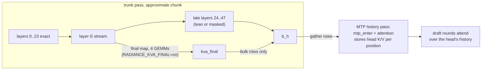

# The MTP `final` map (optional, off by default)

This is an optional second projected map. On an approximated prompt chunk, it supplies the stream that
radiance's multi-token-prediction (MTP) head reads. It is built and tested, but it is not in the release:
`RADIANCE_KVA_FINAL` defaults to `off`. This page covers what it does, what it costs, what it measured, and
when it would be worth turning on. Terms (bulk rows, split S, layer-S stream, staging slot, lean and masked
paths) are defined in [HOW-IT-WORKS.md](HOW-IT-WORKS.md).

## What the MTP head reads

Qwen4-Exp's drafter is radiance's `MtpHcBlock` (`arch/common/rad_block_mtp_hc.h`). It is one extra layer
(attention and MoE with gated hyper-connection residuals, plus its own output mixer) that predicts the
token after next. Head index `i` reads the trunk's hidden state at `i` and the embedding of token `i + 1`,
writes its own K/V at position `i`, and predicts token `i + 2`. Its input is the trunk's **wide stream**:
all 10,240 channels, taken before the trunk's output mixer collapses them. In `qwen4exp_fp8.cpp` that is
`tw.src = m.b_h`, the same buffer the plugin calls `buf_stream`.

The head runs two kinds of pass, chosen by the sign of `RadBatch::draft_pass`:

- **History pass** (`draft_pass < 0`): one row per token. It runs after the trunk's pass for the same
  rows. It gathers those rows of `b_h`, combines them with the next tokens' embeddings (`mtp_enter`) and
  runs the head's attention, which stores the head's K/V and indexer keys for each position. Nothing else
  in the engine writes them. This is the head's **history**.
- **Draft rounds** (`draft_pass > 1`): one row per sequence. They continue from the head's own stream and
  attend over that history. Round 1 is the last row of a history pass.

Since radiance **1.0.13**, a history pass that drafts nothing (`n_draft_out == 0`, which is every prefill
chunk except a prompt's last) stops after the head's attention: no experts, no connections around them, no
`lm_head`. It still reads `b_h` and still writes the head's K/V for every position.

## Why an approximated prompt could hurt drafting

On an approximate trunk pass, a bulk row's `b_h` is not the final stream the head was trained on:

- **lean** (speed): the late layers write only caches and never write `b_h` (`kva_layer.h` `fill_layer`),
  so the bulk rows still hold the **layer-S stream**;
- **masked** (quality): the late layers run on projected inputs with the bulk rows' experts dropped, so
  `b_h` holds a stream the model never computes.

The history pass that follows builds the head's K/V for those positions from that stream, and every later
draft attends over it. The answer text cannot change, because a bad draft is only a rejected draft. The
cost would be acceptance: fewer tokens per step. Earlier research on a different engine (R9V: split 16,
block-rounded tails) measured MTP decode after an approximate prefill at **0.895× the tokens per step of
exact** (range 0.78–0.95) on the first answer.

## What the final map is

A ridge map, fitted offline, from the layer-S stream to the trunk's final wide stream:
`y = h_S · Wᵀ + bias`, with `W` [10,240 × 10,240] and `bias` [10,240], both bf16.

- **Built by** `tools/kva_projector.py final --from FOLDER --proj P --out DIR`. `P` must be the projector
  source file the folder was fitted from: its sha256 is checked against the manifest's `fit.proj_sha256`.
  It holds `final` [w, w + 1] with the bias in the last column. The tool writes `final.safetensors`
  (`final.weight`, `final.bias`), adds a `"final"` block to `kva.json`, and copies every other file byte
  for byte. The int8-final folder R70 used is the int8 folder plus this file (`data/projector-qwen38fn-int8-final`,
  notes/stagee.md §18). It predates the distribution fix and its `kva.json` still lists `README.md`; rebuild
  it with the current tool, or run `tools/kva_projector.py reseal --folder <dir>`, before replacing that README.
- **Checked by** `kva_projector.h` `check_tensors`. When the manifest names a final map, it must be bf16
  with exactly those shapes, or the whole folder is refused.
- **Declared** (`kva_declare_masked.h` `decl_selected`) only when all four hold: `RADIANCE_KVA_FINAL=on`,
  MTP is on (`max_spec > 0`, i.e. `--num-speculative-tokens` > 0), the mode is speed or quality, and the
  folder holds the map. Otherwise nothing of it is declared, held or streamed.
- **Applied** by `kva_final.h` `final_stream`, on every approximate trunk pass after layer 47 and before
  the epilogue. Four GEMMs (`kva_gemm_nt_bias`, one per hyper-connection copy) read the layer-S stream of
  the bulk rows (`h_S` on the masked path; `b_h`'s untouched bulk rows on lean, straddle and decoders
  paths). Block `i` writes columns `i·2,560 … (i+1)·2,560` of the buffer `kva_final`. The predicted rows
  then go into `b_h`: by a plain row copy on the lean path (every row is bulk), and through the device
  mask (`kva_select`, mask-1 rows only) elsewhere, so exact rows, decoders and other sequences keep their
  own stream.



## How it is held and streamed

The map goes through the same staging ring as the projector (`kva_projector.h` `plan_final`). In each
rank's host-mapped block it is stored as four row blocks of [2,561 × 10,240] bf16: 2,560 map rows plus one
bias row each, which is the shape of a bf16 projector block. They follow layer 47 on the ring (ring
indices 48..51) and use the same single VRAM slot. Block 0's copy is issued right after layer 47's GEMM and
overlaps the rest of layer 47. The other three have nothing to hide behind: each copy waits for the
previous block's GEMM (the slot's last reader), and the next GEMM waits for the copy.

The slot is sized to the larger of a layer's block and a final block (`plan_maps`), so **with the final
map the slot is a bf16 block even with int8 maps**. Costs per rank, from the declarations, with
`--max-num-batched-tokens 2048`:

| | final off (int8 folder) | final on | difference |
|---|---|---|---|
| staging slot (VRAM) | 25.4 MiB | 50.0 MiB | +24.6 MiB |
| `h_S`, the copied layer-S stream (VRAM arena) | not declared: int8 maps make their codes from `b_h` at layer S | [2,048 × 10,240] bf16 | +40 MiB |
| `kva_final` (VRAM arena) | — | [2,048 × 10,240] bf16 | +40 MiB |
| host-mapped block | 637.8 MiB | + 4 × 50.0 MiB | +200 MiB |
| link per approximate pass | 0.639 GB | + 4 × 52.4 MB | +210 MB (+33%) |
| GEMM work per approximate pass | 24 maps of [2,560 × 10,240] | + one [10,240 × 10,240] | +17% of the projector's MACs |

The VRAM rows are computed from the declarations (`decl_projected` keeps `h_S` when `want_final`;
`decl_final` declares `kva_final`), not measured. Every request pays VRAM like this in resident experts.
The plugin's existing ~67 MiB per rank measured +0.9–1.2% on prompts that take the stock path
(HOW-IT-WORKS.md, "Streaming the projector"). To check that the map is active, look for `50.0 MiB VRAM`
in the startup line `rank N holds the projector: …`; with the int8 folder and the map off it reads
25.4 MiB.

## Interaction with radiance 1.0.13's history-pass change

The 1.0.13 change cuts the head's **cost** on non-last chunks. It does not change **what the head reads**:
the shortened history pass still gathers `b_h` and still stores the head's K/V for every position from it.
So the deficit the map targets survives the change, and the map remains the only thing that alters the
head's history for bulk positions.

The plugin never approximates a head pass. `kva_step.h` `derive` requires `draft_pass == 0`, so every
history pass and draft round is the in-tree step. The static case
`an_mtp_history_pass_is_the_in_tree_head_whether_or_not_it_drafts` (off, speed and quality, `n_draft_out`
0 and 1) holds the plugin's head pass equal to the in-tree one (notes/rebase-1.0.13.md). The map writes
`b_h` on the trunk pass, before the head reads it, as on 1.0.8.

R70 below was measured on radiance 1.0.8, before the rebase. On 1.0.13, with the map off, the release
session measured 2.31 tokens per step for stock and 2.30 for quality at 16K, MTP depth 3. Those runs had
different texts, so the comparison is unpaired (notes/release-session.md).

## The measurement (R70, notes/staged.md §3)

Quality mode, int8 folder, `T` 2,048, MTP depth 3, 16K prompts, 256 greedy tokens, 5 reps, median tokens
per step:

| arm | tokens / step | vs stock |
|---|---|---|
| stock | 2.265 | 1.000× |
| int8 + final map | **2.339** | 1.033× |
| int8, `RADIANCE_KVA_FINAL=off` | **2.297** | 1.014× |

Final-on and final-off produced **byte-identical texts in all 5 reps**: drafts change speed, never text.
That makes final against off a paired comparison, and final ≥ off in 5 of 5 reps, **+1.8% tokens per
step**. The ratios to stock compare different texts, because KVA changes the continuation.

**Why the deficit does not appear at T = 2,048.** Without the map, quality's acceptance was not below
stock's (1.014×), so R9V's 0.895× was not reproduced. The notes' reading: when drafting starts, the head's
most recent history comes from the exact tail, whose `b_h` rows are the real final stream, and recent
positions are what the draft depends on. R9V's split, tails and engine all differed. The registered
prediction (off in 0.85–0.92×, final − off ≥ 0.03×) was refuted.

## The decision

**Off by default** (Dylan, 2026-10-05). Code, switch and builder are kept. Measured gain: +1.8% drafted
tokens per step. Cost per rank: ~105 MiB more VRAM by the declarations (paid by every request in resident
experts), +200 MiB host memory, and +210 MB over the link per approximate pass. With `off`, the folder's
map, if present, is ignored.

**To turn it on** for a drafting-heavy deployment:

```sh
tools/kva_projector.py final --from <int8 folder> --proj <the projector source it was fitted from> --out <dir>
RADIANCE_KVA=quality RADIANCE_KVA_FINAL=on RADIANCE_KVA_PROJECTOR=<dir>   # with --num-speculative-tokens > 0
```

Check that the startup line shows the 50.0 MiB slot.

## What would make it worth turning on

- **A much shorter tail.** At `T` 512–1,024 more of the head's recent history comes from approximated
  rows. That is closer to R9V's conditions, where the 0.895× deficit appeared.
- **Deeper drafting.** More rounds per step put more tokens per step at stake on the same history, so the
  same history fix is worth more.
- **A different drafter.** A drafter that reads the trunk's per-position hidden states over a longer
  window, or reads deeper layers' streams, would depend more on what the bulk rows hold.
- **Answers that quote the bulk.** Copy-heavy or retrieval answers need drafts conditioned on bulk
  positions, not just the recent tail.
- **A cheaper map.** The map must be bf16 today (`check_tensors`). An int8 final map would halve its slot
  and link bytes. Avoiding `h_S` on the masked path (int8 maps already make their codes from `b_h` at
  layer S) would remove another 40 MiB.

None of these was measured. The first two are one-switch experiments with `tools/mtp_accept.py`.
